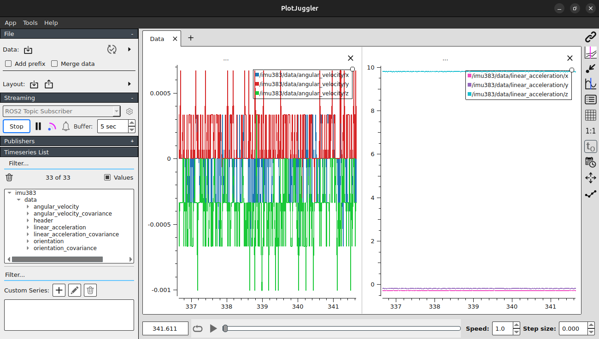

# IMU383 ROS2 Node

This package provides a ROS 2 (Jazzy) driver for the IMU383 sensor. It uses `serial_driver` to connect to the serial device, reads the stream containing Scaled Sensor Data (S1) packets, and publishes standard `sensor_msgs/msg/Imu` data.

## Prerequisites

- ROS 2 Jazzy
- Supported OS: Ubuntu 24.04 (Noble)
- C++17 compiler

### Dependencies

Ensure the ROS 2 dependencies are installed:
```bash
sudo apt update
sudo apt install ros-jazzy-rclcpp ros-jazzy-sensor-msgs ros-jazzy-serial-driver ros-jazzy-asio-cmake-module
```

## Build

Assuming you have a standard colcon workspace (e.g. `~/ros2_ws`), navigate to the root of your workspace:

```bash
cd ~/ros2_ws/src
git clone https://github.com/yiweisong/imu383-ros2 imu383

cd ~/ros2_ws
colcon build --packages-select imu383
source install/setup.bash
```

## Usage

1. **Connect the IMU383**: Plug the device into a USB port.
2. **Permissions**: The user running the node must have read/write access to the serial port.
   ```bash
   sudo usermod -aG dialout $USER
   ```
   *(You'll need to log out and back in for this to take effect)*
3. **Optional fixed parameters**: You can pin the port and baudrate to avoid auto-discovery.
   ```bash
   ros2 run imu383 imu383_node --ros-args -p serial_port:=/dev/ttyUSB0 -p baudrate:=115200
   ```

4. **Run the Node**:
   ```bash
   ros2 run imu383 imu383_node
   ```

## Nodes

### `imu383_node`

This represents the primary driver for the sensor.

#### Published Topics
- `/imu383/data` (`sensor_msgs/msg/Imu`)
   Contains linear acceleration and angular velocity in standard ROS units.
   - linear acceleration: m/s^2
   - angular velocity: rad/s
   Orientation is not provided by the S1 packet, so `orientation_covariance[0] = -1` is set according to ROS IMU conventions.

#### Services (Proposed)
- *Reserved for future implementation.*

#### Parameters
- `serial_port` (string, default: empty):
   - If set, the node tries this exact serial port and baudrate first.
   - If empty, falling back to check `/dev/ttyUSB*` and `/dev/ttyACM*`, it will try from ttyUSB0/ttyACM0 to ttyUSB19/ttyACM19.

- `baudrate` (int, default: 115200):
   - The baudrate to use when connecting to the serial port. The available values are 57600, 115200 and 230400.

## Troubleshooting

- **Node hangs on "Searching for device..."**: If auto-discovery fails, set `serial_port`, `baudrate` explicitly and verify permissions.
- **CRC verification failed**: This can occasionally happen due to noise on the serial line or when connecting mid-stream. The parser will automatically drop corrupted packets and recover on the next valid sync byte.


## Visualization
The node can be visualized with PlotJuggler.

### Install PlotJuggler
```bash
sudo snap install plotjuggler
```

### Add ROS2 Data Source
1. In PlotJuggler, go to `Streaming`.
2. Select the `ROS2 Topic Subscriber`, click `Start`, select the `/imu383/data` in `Topic Selector`, click `OK`.
3. Drag the angular velocity and linear acceleration fields from the left panel to the plot area to visualize the data in real-time.

### Screenshot
